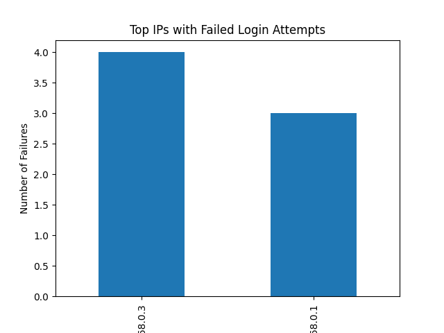

🔍 Log Analyzer in Python

Security log analyzer developed to identify suspicious activities such as multiple failed login attempts and potential brute force attacks.

🚀 Features
Parses authentication logs
Identifies repeated failed login attempts
Detects possible brute force patterns
Displays top IPs with most failures
Generates a bar chart for visualization
Saves results to a .txt file
💻 How to run

pip install -r requirements.txt
python analyzer.py

📁 Project Structure
analyzer.py → main script
sample_log.txt → example log file
results.txt → generated output
examples/ → sample outputs and graph
📊 Example Output

[ALERT] 192.168.0.1 had 3 failed attempts
[ALERT] 192.168.0.3 had 4 failed attempts

📸 Visualization

## 📸 Visualization

  

🧠 Concepts Applied
Python data processing
Log analysis
Pattern detection (brute force)
Data visualization with matplotlib
Data manipulation using pandas

⚠️ Disclaimer
This project was developed for educational purposes only.